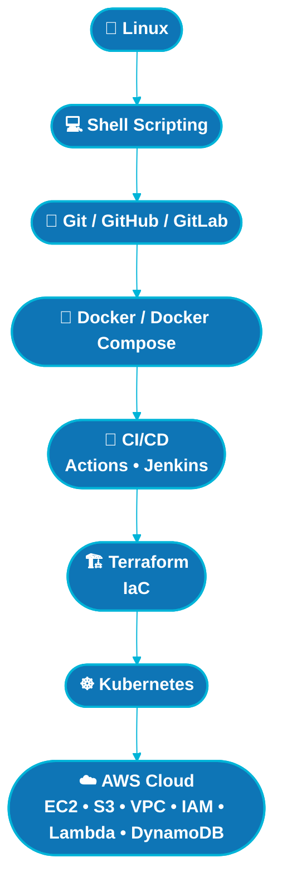
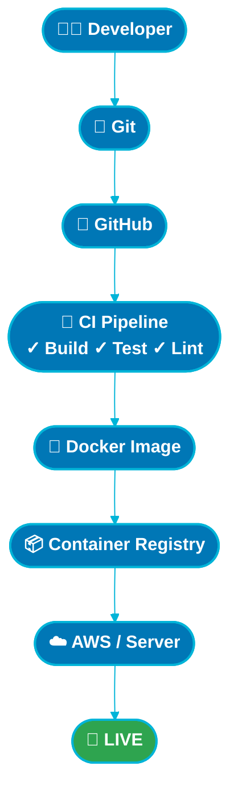
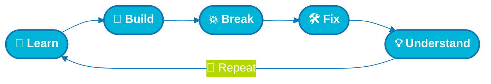

<div align="center">


</div>

<h1 align="center">👋 Hi, I'm Shubhrajyoti Ghosh</h1>

<h3 align="center">
☁️ Cloud & DevOps Enthusiast • AWS • Docker • Kubernetes • CI/CD
</h3>

<p align="center">

<a href="https://github.com/shubhra006">

</a>

<a href="https://github.com/shubhra006?tab=repositories">

</a>

<a href="https://www.linkedin.com/in/shubhrajyoti-ghosh-a4bbab333/">

</a>

<a href="mailto:shubhrajyoti006@gmail.com">

</a>

</p>

<p align="center">


</p>

---

# 👨‍💻 About Me

Hi! I'm **Shubhrajyoti Ghosh**, a Cloud & DevOps enthusiast from India 🇮🇳.

I'm passionate about understanding how applications move from **development to production** using cloud infrastructure, containers, automation and CI/CD.

I enjoy learning by building practical projects and experimenting with real infrastructure.

### 🚀 My current focus

```text
🐧 Linux & Shell Scripting
☁️ AWS Cloud
🐳 Docker & Docker Compose
☸️ Kubernetes
🔄 CI/CD
🔧 Git & GitHub / GitLab
🏗️ Terraform
⚙️ Jenkins
🌐 Nginx
📊 Monitoring & Automation
```

> 💡 **Learn → Build → Break → Fix → Understand → Repeat**

---

# ⚡ My DevOps Workflow

<p align="center">


</p>

---

# 🛠️ Technologies & Tools

## ☁️ Cloud

<p align="center">

<a href="https://aws.amazon.com/">

</a>

<a href="https://azure.microsoft.com/">

</a>

<a href="https://cloud.google.com/">

</a>

</p>

---

## 🐳 DevOps & Infrastructure

<p align="center">

<a href="https://www.docker.com/">

</a>

<a href="https://kubernetes.io/">

</a>

<a href="https://www.terraform.io/">

</a>

<a href="https://www.jenkins.io/">

</a>

<a href="https://git-scm.com/">

</a>

<a href="https://github.com/">

</a>

<a href="https://gitlab.com/">

</a>

</p>

---

## 💻 Programming & Development

<p align="center">

<a href="https://www.python.org/">

</a>

<a href="https://www.gnu.org/software/bash/">

</a>

<a href="https://nodejs.org/">

</a>

<a href="https://react.dev/">

</a>

<a href="https://www.php.net/">

</a>

<a href="https://www.cprogramming.com/">

</a>

</p>

---

## 🗄️ Databases & Web

<p align="center">

<a href="https://www.mysql.com/">

</a>

<a href="https://www.postgresql.org/">

</a>

<a href="https://www.mongodb.com/">

</a>

<a href="https://nginx.org/">

</a>

<a href="https://developer.mozilla.org/en-US/docs/Web/HTML">

</a>

<a href="https://developer.mozilla.org/en-US/docs/Web/CSS">

</a>

</p>

---

# 📊 GitHub Analytics

<p align="center">


</p>

---

# 🔥 Contribution Streak

<p align="center">


</p>

---

# 📈 Contribution Activity

<p align="center">


</p>

---

# 🏆 GitHub Achievements

<p align="center">


</p>

---

# 📌 Featured Projects

<p align="center">

<!-- Replace REPOSITORY-1 and REPOSITORY-2 with your EXACT repository names -->

<a href="https://github.com/shubhra006/REPOSITORY-1">

</a>

<a href="https://github.com/shubhra006/REPOSITORY-2">

</a>

</p>

<p align="center">

<a href="https://github.com/shubhra006/REPOSITORY-3">

</a>

<a href="https://github.com/shubhra006/REPOSITORY-4">

</a>

</p>

---

# ☁️ Cloud & DevOps Journey



---

# 🚀 AWS Services I'm Exploring

<p align="center">


</p>

<p align="center">


</p>

---

# 🔄 CI/CD Pipeline



---

# 🌱 Currently Learning

<p align="center">


</p>

<p align="center">


</p>

---

# 🎯 2026 Goals

| Goal                            | Status      |
| ------------------------------- | ----------- |
| 🐧 Linux & Shell Scripting      | 🔄 Learning |
| 🐳 Docker & Docker Compose      | 🔄 Learning |
| ☁️ AWS Cloud                    | 🔄 Learning |
| 🔄 CI/CD                        | 🔄 Learning |
| 🏗️ Terraform                   | 🔄 Learning |
| ☸️ Kubernetes                   | 🔄 Learning |
| ⚙️ Jenkins                      | 🔄 Learning |
| 📊 Monitoring & Observability   | ⏳ Next      |
| 🌍 Open Source Contributions    | ⏳ Next      |
| 🚀 Production-style Deployments | ⏳ Next      |

---

# 💡 What I Like Building

<div align="center">

| | | |
|:---:|:---:|:---:|
| ☁️ **Cloud Infrastructure** | 🐳 **Containerized Applications** | 🔄 **CI/CD Pipelines** |
| 🏗️ **Infrastructure as Code** | 🐧 **Linux Automation** | ☸️ **Kubernetes Deployments** |
| 🚀 **Automated Deployments** | 🌐 **Web Applications** | 📊 **Monitoring** |

</div>

---

# 📚 Learning Philosophy



---

# 📫 Connect With Me

<p align="center">

<a href="https://github.com/shubhra006">

</a>

<a href="https://www.linkedin.com/in/shubhrajyoti-ghosh-a4bbab333/">

</a>

<a href="mailto:shubhrajyoti006@gmail.com">

</a>

</p>

---

<div align="center">

### ⭐ Thanks for visiting my profile!

### 🚀 Keep Learning • Keep Building • Keep Automating

<br/>


</div>
